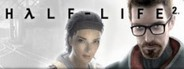

### Hi there, I'm Guglielmo Grillo - aka [NerusSkyhigh][website] 👋

<!-- 

 -->

I'm a Physics Student, traceur, storyteller and overall a curious person!

<!--
- 🔭 I just launched my first course: [Become A VS Code SuperHero!][course]!
- 🌱 I’m currently learning everything 🤣
- 👯 I’m looking to collaborate with other content creators
- 🥅 2020 Goals: Contribute more to Open Source projects
- ⚡ Fun fact: I love to draw and play guitar / drums
-->

### University 📖
I'm currently getting a Master Degree in Physics. My specialisation path is Statistical Mechanics with a focus on computational methods. I choose this path because...

---

### Progetto Apollo 🚀

---

### Parkour 🏃🔥
After spending many years without finding something I really enjoy doing, I came across parkour in my second year of University. It was a revelation: parkour is freedom, rules and challenges all at the same time. I'm definitely not a pro, but I never miss an opportunity to challenge myself. My next goal is to manage to perform a front flip.

---

### Videogames 🎮
Games are a big part of my life because they represent how I aim to live my life: with a good story worth to be told, challenging and always with more room for improvement.

Lately I've been playing a lot of Doom Eternal, right now my goal is to beat again the DLC at Nightmare without using the Sentinel Armor during the last boss battle.

  
Other games I loved, in no particular order, are:

  
  
  
  
  
  

---

### Connect with me:

[][website]
[][linkedin]
[][instagram]

 

### Languages and Tools:

[][website]

<!-- https://simpleicons.org/ -->

[website]: .
[instagram]: https://www.instagram.com/_sir_gg_/
[linkedin]: https://www.linkedin.com/in/guglielmo-grillo/
